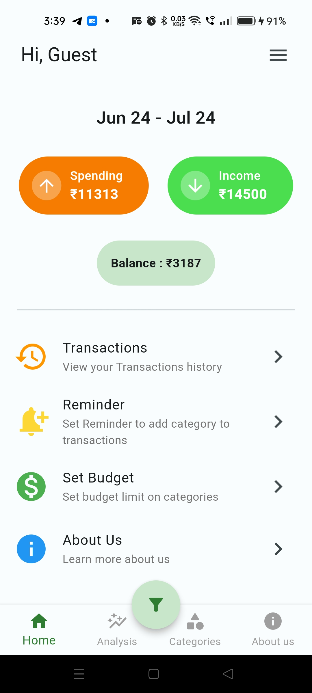
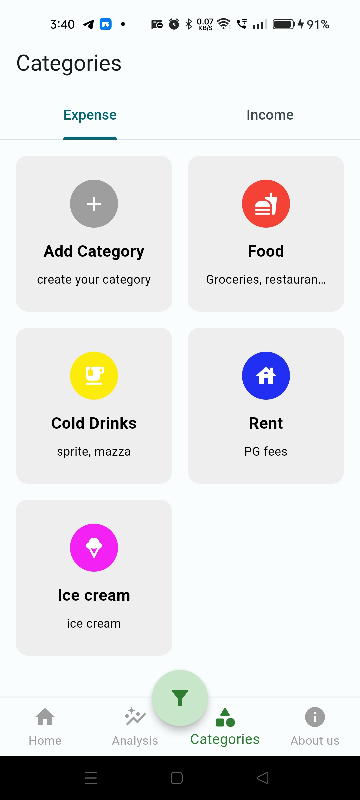
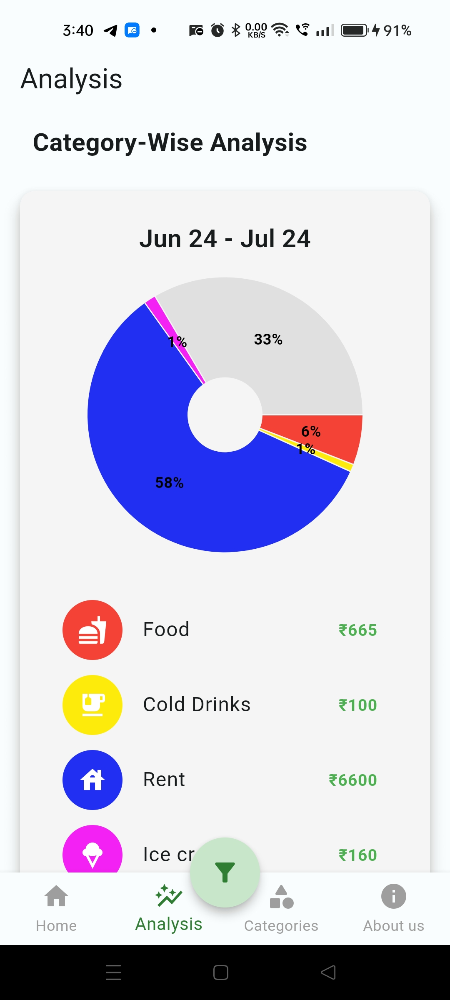

# Expense Tracker
- This application helps you keep **track** of your **Expenses** and **Income**.  
- You can manage your daily expenses.  
- You can track your unnessary expenses and avoid them.
- It gets the data from the Bank transaction SMS.

### NOTE : As of Now, this application will work only for Bank Of Baroda(BOB) customers.

## Technologies used
- Flutter
- Dart

## Images

<table>
  <tr>
    <td></td>
    <td></td>
    <td></td>
  </tr>
</table>
